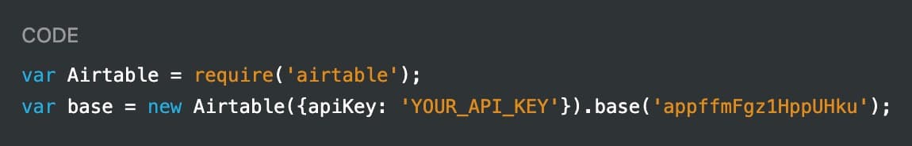
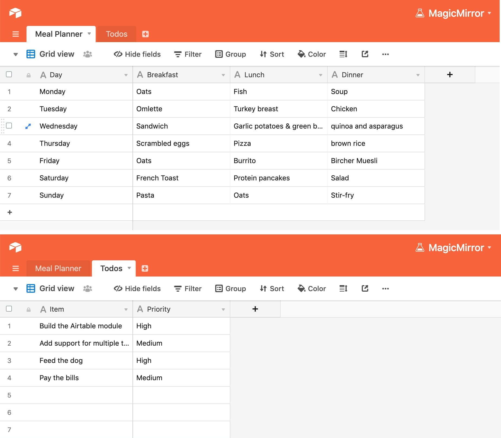
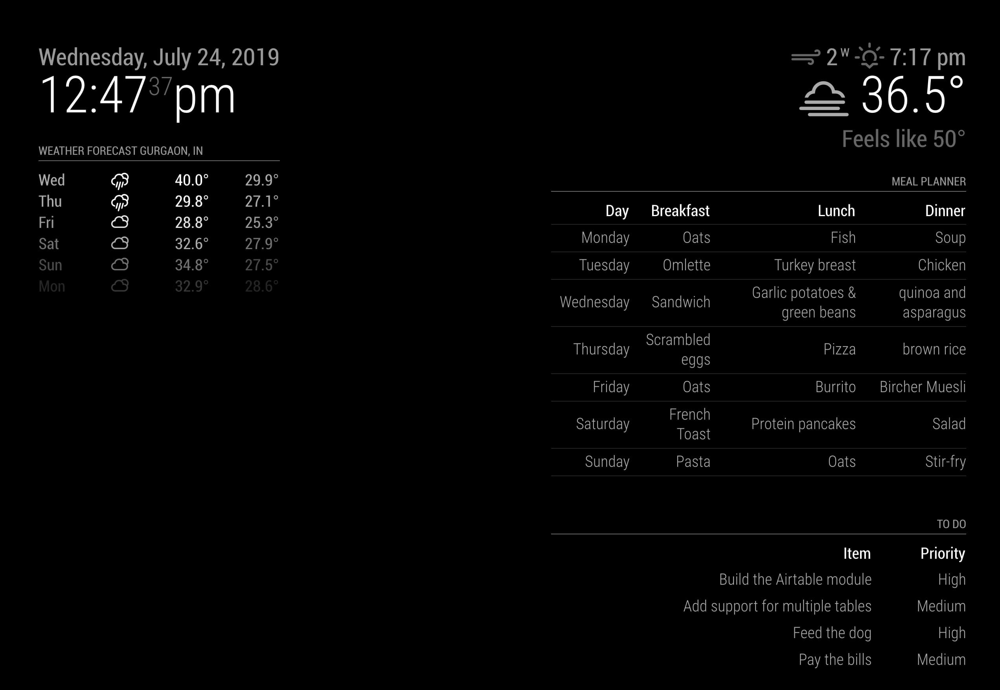

# MMM-Airtable
This a module for the [MagicMirror](https://github.com/MichMich/MagicMirror/tree/develop).

It can display your Table(s) from your Airtable and update them at a regular interval. Check the screenshots for more details.

# Installation
1. Navigate into your MagicMirror `modules` folder and execute
`git clone https://github.com/yashatgit/MMM-Airtable.git`.
3. Enter the `MMM-Airtable` directory and execute `npm install`.
`cd MMM-Airtable && npm install`.

# Airtable API configuration
Go to https://airtable.com/api and select the **base** to view its API documentation. Click the Javascript version of the Sample API. 
(Just search for the keyword `apiKey` and you will find the relevant details.)



We would need following details for the module to fetch the data:
1. API key
2. Base id
3. Table name(s)

# Module Config
<table>
  <thead>
    <tr>
      <th>Option</th>
      <th>Description</th>
    </tr>
  </thead>
  <tbody>
    <tr>
      <td><code>airtableAPIKey</code></td>
      <td><strong>REQUIRED</strong> API Key for Airtable.<br><br><strong>Type:</strong> <code>string</code></td>
    </tr>
    <tr>
      <td><code>airtableBaseId</code></td>
      <td><strong>REQUIRED</strong> Airtable Base ID.<br><br><strong>Type:</strong> <code>string</code></td>
    </tr>
    <tr>
      <td><code>animationSpeed</code></td>
      <td>Table refresh change animation time in ms.<br><br><strong>Type:</strong> <code>number</code><br>Defaults to <code>1500</code></td>
    </tr>
    <tr>
      <td><code>updateInterval</code></td>
      <td>Interval for refetching the latest data.<br><br><strong>Type:</strong> <code>number</code><br>Defaults to <code>60*1000</code> (i.e. one minute).</td>
    </tr>
    <tr>
      <td><code>tables</code></td>
      <td>A list of table configurations. See Table below for more details.<br><br><strong>Type:</strong> <code>array</code></td>
    </tr>
  </tbody>
</table>
<br>

Each object in the `tables` array can have the following parameters:

<table>
  <thead>
    <tr>
      <th>Option</th>
      <th>Description</th>
    </tr>
  </thead>
  <tbody>
    <tr>
      <td><code>workspaceName</code></td>
      <td><strong>REQUIRED</strong> Name of the Workspace Tab/Table.<br><br><strong>Type:</strong> <code>string</code></td>
    </tr>
    <tr>
      <td><code>tableTitle</code></td>
      <td>Optional title for your table. How you would like this displayed on your MagicMirror?<br><br><strong>Type:</strong> <code>string</code></td>
    </tr>
    <tr>
      <td><code>maxRows</code></td>
      <td>Optional number to limit the maximum rows to be displayed.<br><br><strong>Type:</strong> <code>number</code><br>Defaults to <code>20</code></td>
    </tr>
    <tr>
      <td><code>updateInterval</code></td>
      <td>Optional interval for refetching the latest data. Overrides the value from <code>updateInterval</code> in main config.<br><br><strong>Type:</strong> <code>number</code></td>
    </tr>
    <tr>
      <td><code>rowBorder</code></td>
      <td>Optional bool check to show Borders below each row.<br><br><strong>Type:</strong> <code>boolean</code></td>
    </tr>
  </tbody>
</table>

<br>
Example of an entry in `config.js` which displays 2 tables as shown in Screenshot

```
{
  module: 'MMM-Airtable',
  position: 'top_right',
  config: {
	airtableAPIKey: '<YOUR_API_KEY>',
	airtableBaseId: '<YOUR_BASE_ID>',
	animationSpeed: 1.5 * 1000,
	updateInterval: 1000 * 50, //refresh after 50 sec
	tables: [
	  {
		workspaceName: 'Meal Planner',
		tableTitle: 'Meal Planner',
		maxRows: 7,
        rowBorder: true,
	  },
	  {
		workspaceName: 'Todos',
		tableTitle: 'To Do',
		maxRows: 8,
	  },
	],
  },
},
```

<br>

## Screenshots


